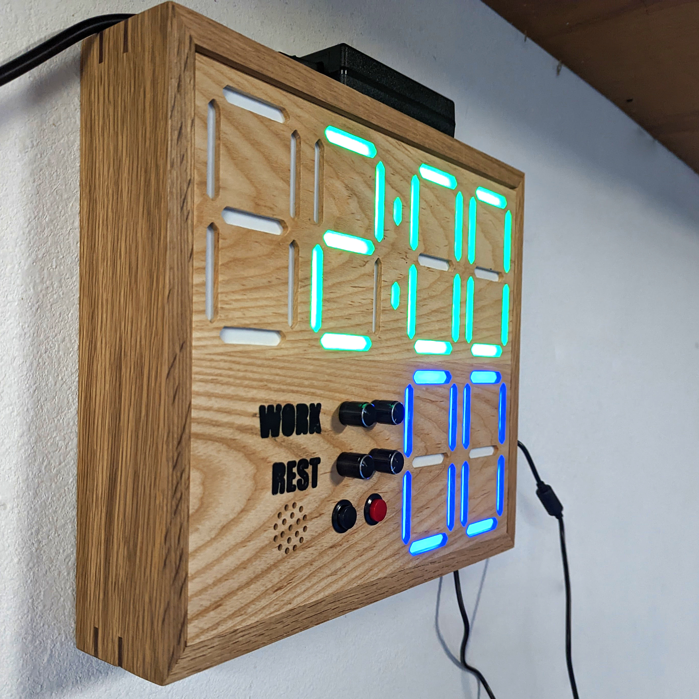

# CapyTimer

CapyTimer is meant to be a simple timer for
boxing/kickboxing/grappling/fitness.  My goal is to keep its interface
as simple as possible while maintaining the most important
functionality.  Work and rest times are set with dials, and the timing
started and stopped with a switch or button.  The display counts the
remaining time, the current round, and nothing else.

The display is constructed from WS2812B addressable LEDs.  The
original plan was to cut up and solder three-LED sections to create
the digits, but that proved time consuming and ugly so I ultimately
designed a PCB for the digits with the LEDs pre-placed.  You can
follow the original plan and save some money by cutting up and
soldering a WS2812B strip, or just order the PCBs preassembled from
JLC (or just get the boards manufactured and solder on the LEDs
yourself).

This isn't really meant to be a prescriptive set of instructions for
building the timer exactly a certain way.  I've provided components
here and I'll lay out a general path towards putting it together, but
you should feel free to substitute different controls and alter the
presentation to your liking.

**Warning** - The remote control design is currently untested.  I
*think* the parts will all fit properly, but I'm still waiting on the
final PCBs to test with and can't guarantee that the design works yet.

## Directory Structure

* `3d/` - Files for 3D printing.  These include the digit and
  separator diffusers, the remote control body, and a set of printed
  frames to hold the digits for testing purposes.
* `firmware/` - Code to run the AVR microcontroller.  Specifically
  this expects an Atmega328P, the avr-gcc toolchain and a USBasp
  programmer.  If you deviate from these specifications you may need
  to alter the firmware and makefile.
* `pcb/` - KiCad schematics and PCB designs.  This includes the main
  control board, boards with the LEDs laid out for the digits and
  separator, and a control board for the remote control.  With the
  exception of the remote control board (which is simple enough to
  easily hand solder), I've included gerbers and BOM/placement files
  that you can use to have the boards manufactured by JLCPCB.  These
  worked as of this publishing, but be warned that some parts may go
  out of stock and need replacing (they already switched to a new
  version of the WS2812B LEDs while I was working on the boards).
* `enclosure` - SVG designs to cut a front for the timer using the
  Shaper Origin.  You'll have to adapt these if you use a different
  CNC.

## Assembly Instructions

Please don't consider these instructions exhaustive, but more general
guidance.  You'll want to have some experience with electronics,
soldering and crimping connectors before getting started on this, as
well as some way to build an enclosure for the timer (I build mine out
of wood).

### Materials

| Part | Qty |
| ---- | --- |
| Control Board | 1 |
| Digit Board | 6 |
| Separator Board | 1 |
| Digit Diffuser | 6 |
| Separator Diffuser | 1 |
| M3x4.6x5.7mm Heat Set Inserts | 17 |
| M3x6 Screw | 14 |
| Linear Potentiometer (somewhere in the neighborhood of 10k) | 4 |
| Push Button | 2 |
| JST-PH Connector (3 pin) | 20 |
| JST-PH Connector (2 pin) | 4 |
| DC Barrel Connector | 1 |
| Right Angle Header (Female, 2.54mm) | 14 pins |
| Header (Male, 2.54mm) | 3 pins |
| Header Jumper | 1 |
| AVR-ISP 6 Pin Box Header | 1 |
| 3386P Potentiometer | 2 |
| 10k Through Hole Resistor | 2 |
| QIACHIP 433Mhz Transmitter/Receiver Set | 1 |
| Remote Control Parts | 1 set |
| M3x12 Screw | 3 |
| 5x1mm Round Magnet | 8 |
| AAA Battery Contact Plate | 4 |

Note that this doesn't include surface-mount components on the PCB,
only the parts you'll need to manually assemble.  If you intend to
hand solder the PCBs, consult the schematics for part listings.

### The Display

The display uses six digits and one separator between the minutes and
seconds.  You can have the digits and separator LEDs pre-assembled on
a PCB by JLCPCB using the files in the `pcb/` directory, or you can
buy a strip of WS2812B LEDs and glue them into the 3D printed
diffusers.  If you do so, you'll want to use 3 LEDs per digit segment
and one for each of the dots in the separator.  The LEDs should be
laid out in the same order that segments normally come in a seven
segment display.

If you get your LED PCBs pre-assembled, you'll still need to solder on
the connectors.  Use one three-pin JST-PH connector for each
connection.  Be sure to solder these on the back side of the board so
you can plug in to them while the front of the board is seated in the
diffuser.

When printing the plastic diffusers, I like to use white filament for
the first few layers and then switch to black.  This will minimize
light bleeding between segments while the display is in use.  If you
use PCBs for the digits and separator, the diffusers have holes for
threaded inserts.  You can then use the M3x6 screws to attach the
boards to the diffusers.

### The Control Board

Assuming you get the control board assembled by JLCPCB or some other
manufacturer, you'll just need to solder the connectors and a few
potentiometers onto the control board.  These include the DC barrel
jack for power, JST-PH connections for the screen, potentiometers and
push buttons, the AVR-ISP header, the header for the diagnostic jumper
(optional) and the angled header for the QIACHIP receiver module
(optional, only required if you want to use the remote control).  The
two 3386P potentiometers are used for volume and brightess control and
should be soldered directly onto the board.

The `JRESET1` connector is currently unused and can be safely ignored.

To program the microcontroller, just connect the ISP header to a
USBasp programmer.  You'll need the avr-gcc toolchain and avrdude
installed.  You can then run `make fuse` to program the fuses on the
chip, and `make program` to transfer the firmware.  After that the
timer should just work when everything is plugged in.

### Connections

* Solder a DC barrel jack connector onto `J1` for power.
* Connect four potentiometers to the 3-pin JST-PH connectors on the
  top-left corner of the board.  These will set the minutes and
  seconds for the work and rest periods.  The names on the silk screen
  are abbreviations for the function of the potentiometer, e.g. `JWM1`
  is the connection for the potentiometer that controls the minutes of
  the work period.  For these connectors, pin 1 is ground, pin 2 is
  signal, and pin 3 is +5v.
* The display connects to `JOUT1` and `JOUT2` via 3-pin JST-PH
  connectors.  Pin 1 is ground, pin 2 is signal, pin 3 is +5v.  As
  long as you connect the same pins on each end of your cables
  everything should work.  The WS2812B LEDs are daisy chained, so
  `JOUT1` should connect to the `JIN1` connector of the first digit,
  then its `JOUT1` connector should connect to the `JOUT1` of the next
  digit, and so on.  Connect the digits and separator for the time
  first, and then the two digits for the round display.  Finally, you
  can connect `JOUT1` on the last digit to `JOUT2` on the control
  board.  This final connection is for power only, to reduce the
  current that needs to flow through the first connection between
  control board and digits.
* The start and stop buttons should connect to the 2-pin JST-PH
  connectors labeled `JSTART1` and `JSTOP1`.  `JRESET1` is unused.
  These connectors have no polarity, they just need to be normally
  open and close when the buttons are pushed.
* Connect an active piezo buzzer to the 2-pin JST-PH connector labeled
  `JBUZZ1`.
* You may optionally solder a 3 pin male header to `JDIAG1`.  Place a
  jumper across the right two pins for normal operation: shifting the
  jumper to the left will put the timer in diagnostic mode, which
  displays the raw ADC value from the work minutes potentiometer for
  debugging purposes.
* If you intend to use a remote control, solder 7 pin female header,
  preferably right-angle, to `JRF1`.  You can then insert a QIACHIP
  receiver module directly into the header.

### Enclosure

The enclosure is largely left as an exercise for the reader.  You'll
want to select potentiometers and push buttons that fit your desired
aesthetic, and you may also wish to add features like an on/off switch
and external power inlet to the enclosure.

Because of the size of the timer, I haven't included a 3D printed
enclosure design.  Even with a 400x400 print bed, it would be
prohibitive to fit all six digits and the controls.  I have, however,
included two 3D printed frames that can hold the digit diffusers up
(with CA glue).  These aren't suitable for production use, but served
me well during development.

For production use, I build my enclosures as open-backed wooden boxes
with a front panel that has pockets routed in for the digit diffusers,
controls and the piezo buzzer.  I use a Shaper Origin to make the cuts
in the front panel, and you can find the SVG files for my design in
the `enclosure/` directory.  I've only tested these with the Shaper,
and expect that other CNCs will probably need some work to adapt them.

### Remote Control (Optional)

With a QIACHIP receiver and transmitter set, you can also build a
remote control for your timer.  The `pcb/` directory includes a small
PCB to tie the QIACIP transmitter to some tactile push button switches
and two AAA batteries.

For the remote control board, you'll need to solder on two pull-up
resistors, two tactile push-button switches (use switches tall enough
to poke up through the remote body), and a connector for the batteries
(or just solder the battery connectors directly to the board).  Add
right-angle header for the QIACHIP transmitter, and solder on an
antenna to `JANT1`.

The top remote component has holes for three heat-set inserts and four
5x1mm magnets, which should be glued into place.  You'll also want to
glue in the four battery contact plates, alternating positive and
negative plates between the two battery slots.  Solder the two plates
at the bottom of the remote together, and then solder wires on to the
connectors towards the top.

Glue opposite-polarity magnets into the remote lid to hold it on to
the body.  You can then attach the PCB and the remote body bottom to
the top by using the three M3x12 screws.  This connection is
inherently weak because the stems holding everything together are
stressed perpendicular to their layers, so be careful not to tighten
the screws more than necessary to hold everything together.

## Afterword

This should give you a rough idea of how to assemble one of these
timers, but the instructions aren't exceedingly detailed and leave a
lot of room to make the project your own.  If you attempt to build one
and run into problems, feel free to submit an issue.  And if you come
up with a design improvement, pull requests are welcome.
